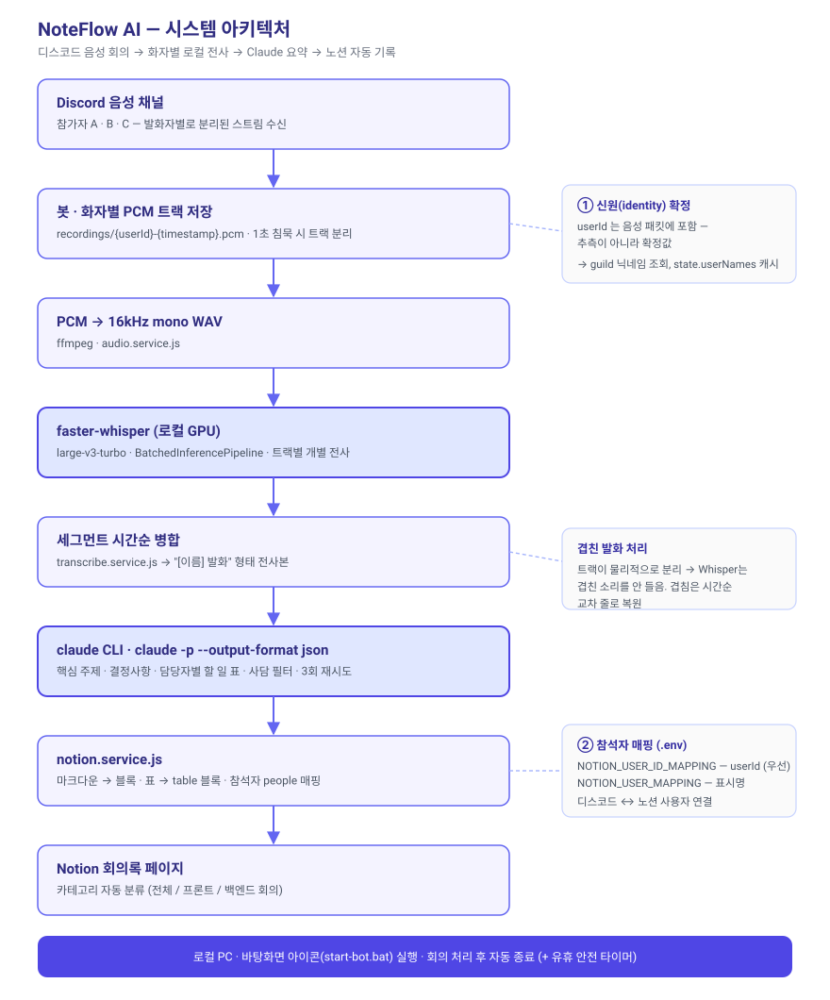

# NoteFlow AI (Discord to Notion)

> **디스코드 음성 회의를 수집해 사람별로 전사(faster-whisper)한 뒤, Claude(`claude` CLI)로 요약하여 노션 데이터베이스에 자동 기록하는 에이전트입니다.**

"북잡(Bookjob)" 팀의 생산성을 높이기 위해 개발되었으며, 긴 회의 중 발생하는 사담을 필터링하고 핵심 액션 플랜을 도출하는 데 최적화되어 있습니다.


---

## 처리 파이프라인

```
/회의시작  → 음성 채널 입장 → 발화자별로 각각 PCM 트랙 저장
/회의종료  → 트랙별 PCM → 16kHz mono WAV 변환
           → faster-whisper(GPU)로 트랙별 전사
           → 세그먼트를 시간순으로 병합 → "[이름] 발화" 형태 전사본
           → claude CLI(`claude -p`)로 요약(사담 필터 + 담당자별 할 일)
           → 노션 페이지 생성 (마크다운 → 블록, 참석자 매핑, 카테고리 분류)
```

화자를 **디스코드 신원으로 확정**하므로(트랙 분리 전사), 섞인 음성에서 화자를 추측하던 이전 방식보다 담당자별 정리가 정확합니다.

## 주요 기능
* **발화자별 트랙 녹음**: 디스코드 음성 채널의 유저별 스트림을 각각 PCM으로 저장.
* **로컬 GPU 전사**: `faster-whisper` `large-v3-turbo` + 배치 파이프라인을 CUDA로 구동. 외부 전송 없이 로컬에서 전사.
* **진행 상황 표시**: `/회의종료` 처리 중 전사·요약·업로드 단계를 메시지로 실시간 갱신.
* **Claude 요약**: `claude` CLI 헤드리스 호출(`claude -p --output-format json`). 별도 API 키 불필요(기존 Claude Code 인증 사용).
* **사담 필터링**: 프롬프트로 안부 인사·농담 등 제외. 발언 기록 없는 사람은 담당자 정리에서 자동 제외.
* **노션 연동**: 요약 마크다운을 파싱(볼드/헤딩/리스트)하여 블록 단위로 업로드.
* **참석자 자동 매핑**: 디스코드 참여자를 노션 사용자(Attendees)에 연결.
* **카테고리 자동 분류**: 참석 인원에 따라 `전체 회의` / `프론트 회의` / `백엔드 회의` 판별.
* **자동 종료**: 회의 처리 완료 후 약 10분 뒤 봇 프로세스 자동 종료(유휴 3시간 안전장치 포함).

## NoteFlow AI — 시스템 아키텍처


## 기술 스택
* **Runtime**: Node.js, Python (가상환경 `.venv`)
* **Library**: `discord.js`, `@discordjs/voice`, `prism-media`
* **STT**: `faster-whisper` (CTranslate2 / CUDA)
* **AI 요약**: `claude` CLI (Claude Code)
* **Tools**: `FFmpeg` (via `ffmpeg-static`), `@notionhq/client`

## 프로젝트 구조
```
bookjob-ai-bot/
├── index.js                          # 엔트리 포인트 (봇 초기화 및 이벤트 바인딩)
├── start-bot.bat                     # 바탕화면 더블클릭 실행용 런처
├── scripts/
│   ├── setup.md                      # 최초 1회 세팅 가이드
│   └── transcribe.py                 # faster-whisper 래퍼 (WAV → 세그먼트 JSON)
├── src/
│   ├── lifecycle.js                  # 자동 종료 타이머
│   ├── config/
│   │   ├── clients.js                # 외부 클라이언트 초기화 (Notion, ffmpeg)
│   │   └── commands.js               # 디스코드 슬래시 커맨드 정의 및 등록
│   ├── handlers/
│   │   └── interaction.handler.js    # 슬래시 커맨드 처리
│   ├── services/
│   │   ├── audio.service.js          # PCM → WAV 변환
│   │   ├── transcribe.service.js     # 트랙별 전사 + 시간순 병합
│   │   ├── claude.service.js         # claude CLI 요약 요청
│   │   └── notion.service.js         # 노션 페이지 생성 및 마크다운 파싱
│   └── state.js                      # 참석자 목록 등 런타임 상태 관리
├── .env                              # 환경 변수 (Git 미추적)
└── .gitignore
```

## 설치 및 실행

**최초 1회 세팅은 [`scripts/setup.md`](scripts/setup.md) 참고** (Node 의존성 + Python 가상환경 + faster-whisper + 바탕화면 아이콘).

### 환경 변수 (`.env`)
```env
DISCORD_TOKEN=your_discord_bot_token
NOTION_KEY=your_notion_integration_token
BJ_NOTION_DATABASE_ID=your_notion_database_id
NOTION_USER_MAPPING={"이름":"노션_유저_ID", ...}

# --- 선택 ---
# NOTION_USER_ID_MAPPING={"디스코드_userId":"노션_유저_ID", ...}   # 이름보다 우선 적용, 표시명 바뀌어도 안전
# CLAUDE_BIN=C:\Users\<사용자>\AppData\Roaming\npm\claude.cmd     # claude 실행이 안 될 때만
# AUTO_EXIT_MINUTES=10        # 회의 처리 후 자동 종료까지 대기(분). 0이면 자동 종료 안 함
# SAFETY_IDLE_HOURS=3         # 유휴 상태 이 시간 지나면 종료. 0이면 안전 타이머 끔
# WHISPER_MODEL=large-v3-turbo  # 정확도 최우선이면 large-v3
# WHISPER_BATCH=8            # 배치 전사 크기. 0이면 단일 모드
# WHISPER_DEVICE=cpu / WHISPER_COMPUTE=int8   # GPU 문제 시 CPU 폴백
```
| 변수 | 설명 |
|:---|:---|
| `DISCORD_TOKEN` | 디스코드 봇 토큰 |
| `NOTION_KEY` | 노션 내부 통합(Integration) 토큰 |
| `BJ_NOTION_DATABASE_ID` | 회의록을 저장할 노션 데이터베이스(Data Source) ID |
| `NOTION_USER_MAPPING` | 팀원 **이름** → 노션 User ID JSON |
| `NOTION_USER_ID_MAPPING` | (선택) 디스코드 **userId** → 노션 User ID JSON. 이름 매핑보다 우선 |
| `CLAUDE_BIN` | (선택) `claude` 실행 파일 절대경로 |
| `AUTO_EXIT_MINUTES` / `SAFETY_IDLE_HOURS` | (선택) 자동 종료/안전 타이머 시간 |
| `WHISPER_MODEL` / `WHISPER_BATCH` / `WHISPER_DEVICE` / `WHISPER_COMPUTE` | (선택) 전사 엔진 튜닝 |

> `GEMINI_API_KEY` / `ANTHROPIC_API_KEY` 는 필요 없습니다. 요약은 로컬에 로그인된 `claude` CLI가 처리합니다.

### 실행
- **평상시**: 바탕화면 `회의봇 시작` 아이콘(= `start-bot.bat`) 더블클릭
- **터미널**: `npm start`

## 슬래시 커맨드

| 커맨드 | 설명 |
|:---|:---|
| `/회의시작` | 음성 채널에 입장하여 회의 녹음을 시작합니다. |
| `/회의종료` | 녹음을 종료하고 전사·AI 요약본을 생성하여 노션에 저장합니다. |
| `/회의정리재시도` | 요약/노션 전송이 실패했을 때 보존된 전사본으로 다시 시도합니다. |
| `/노션재전송` | 마지막으로 생성된 요약본을 노션으로 다시 전송합니다. |
| `/노션저장` | 입력한 텍스트를 직접 노션 회의록에 저장합니다. |
| `/봇종료` | 봇을 지금 바로 종료합니다. (자동 종료를 기다리지 않음) |

`/회의종료` 처리 중에는 "전사 중 (n/트랙) → AI 요약 중 → 노션 업로드 중" 진행 상황이 메시지에 실시간 표시됩니다.

## 트러블슈팅

### PCM 포맷 처리
디스코드 PCM은 헤더가 없어 FFmpeg에 입력 옵션(`-f s16le -ar 48000 -ac 2`)을 강제로 주어 16kHz mono WAV로 변환한 뒤 전사합니다.

### faster-whisper / CUDA
`WhisperModel(..., device="cuda", compute_type="float16")` + `BatchedInferencePipeline`(batch_size=8)로 트랙별 전사. 기본 모델은 `large-v3-turbo`(large-v3와 정확도 비슷, 2~4배 빠름).

- CUDA 런타임 DLL은 `transcribe.py`가 `.venv\...\nvidia\*\bin` 을 `os.add_dll_directory`로 자동 등록.
- HF 모델 다운로드 시 Windows 심볼릭 링크 권한 오류(WinError 1314)를 피하려고 `HF_HUB_DISABLE_SYMLINKS=1` 설정.
- 그래도 GPU가 안 되면 `WHISPER_DEVICE=cpu WHISPER_COMPUTE=int8`(느림). 정확도 최우선이면 `WHISPER_MODEL=large-v3`.

### claude CLI 호출
`execFile('claude', ['-p','--output-format','json'])` + 프롬프트는 stdin으로 전달(긴 전사본의 명령행 길이 제한 회피). Windows에서는 `shell: true`로 `claude.cmd`를 실행. 실패 시 지수 백오프로 3회 재시도.

### 노션 API 마크다운 파싱
2,000자 제한과 서식 미지원을 해결하기 위해 요약본을 줄 단위로 파싱하여 헤딩(`##`), 볼드(`**`), 불릿(`- `, `* `)을 노션 블록으로 변환합니다. 연속된 `| ... |` 줄은 노션 `table` 블록으로 묶어 변환하며(구분선 자동 스킵, 첫 행을 헤더로), 담당자별 할 일이 표로 렌더됩니다.

### 노션 SDK 호환성 (v5.x)
`data_source` 개념 도입으로 `database_id` 기반 페이지 생성이 동작하지 않아 `notion.request` 저수준 호출로 전환했습니다.

---

## Author
**이은석 (Frontend Developer)** "북잡(Bookjob)" 서비스의 프론트엔드 리드로서 팀의 개발 문화와 생산성 도구를 고민합니다.

---
